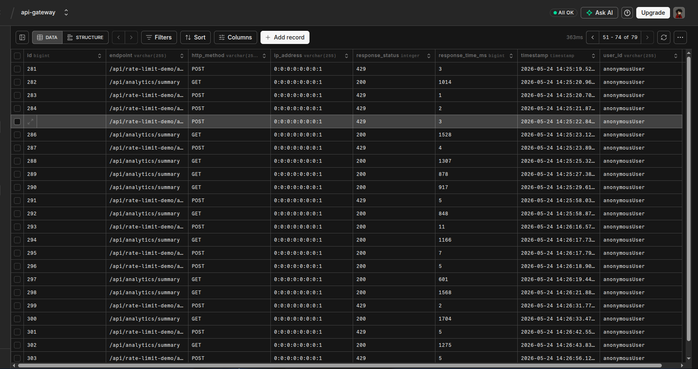
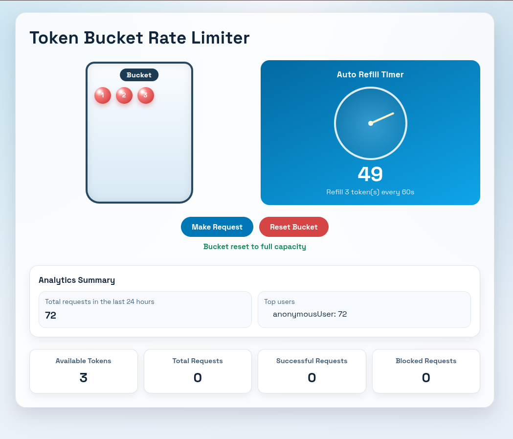
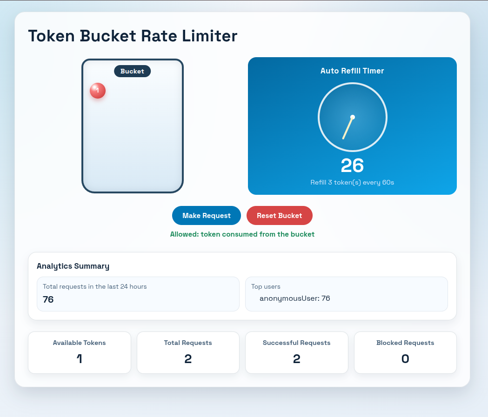
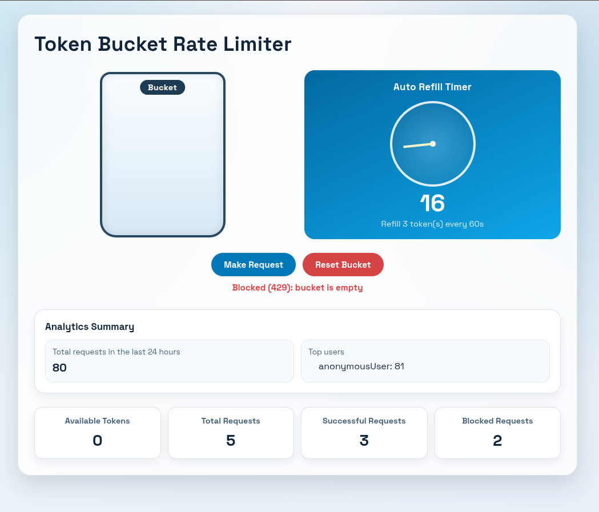

# API Gateway Rate Limiter

API Gateway Rate Limiter is a Spring Boot gateway application that demonstrates JWT-based authentication, token-bucket rate limiting, request logging, and analytics backed by PostgreSQL. It is designed as a single entry point for API traffic and includes a small dashboard for viewing rate-limit state and request statistics.

## What This Project Uses

- Spring Boot 4
- Spring Web MVC interceptors
- Spring Security
- PostgreSQL for API request logs
- Redis for rate limiting state
- Thymeleaf for the dashboard UI

## Features

- JWT authentication support
- Token-bucket rate limiting for the audit endpoints
- IP and user-based throttling
- API request logging to PostgreSQL
- Analytics summary for recent request activity
- Dashboard UI for testing the limiter

## Rate Limiting

This project uses a token bucket rate limiter.

How it works:

- Each protected key starts with a fixed number of tokens.
- Every allowed request consumes one token.
- Tokens are refilled after a fixed interval.
- When no tokens are left, the request is blocked with HTTP 429.
- The limiter state is stored in Redis so multiple requests share the same bucket state.

Where it applies:

- Rate limiting is applied only to the audit POST routes under `/api/rate-limit-demo/audit/**`.
- Analytics and other API routes stay available so the dashboard can keep fetching data.

Why rate limiting is used:

- It protects the API from abuse and rapid repeated requests.
- It prevents one client from consuming all available capacity.
- It keeps the analytics and dashboard experience responsive.
- It allows the audit endpoints to be tested safely without affecting the rest of the API.

## Prerequisites

- Java 21
- Maven Wrapper (`./mvnw`)
- Docker
- A running PostgreSQL database
- A running Redis container

## Redis Setup

This project expects Redis to be available locally on port `6379`.

If the Redis container already exists, start it with:

```bash
sudo docker start redis-gateway
```

If you need to create the container for the first time, use:

```bash
sudo docker pull redis:7
sudo docker run -d --name redis-gateway -p 6379:6379 redis:7
```

Verify that Redis is running before starting the application.

## PostgreSQL Setup

The application stores API logs in PostgreSQL. Set the database connection values locally before starting the app:

```bash
export DB_URL='<your-postgres-jdbc-url>'
export DB_USER='<your-postgres-username>'
export DB_PWD='<your-postgres-password>'
```

## Run The Application

After Redis is started and the database variables are exported, start the app with:

```bash
./mvnw spring-boot:run
```

You can also run the full command in one line:

```bash
sudo docker start redis-gateway && export DB_URL='<your-postgres-jdbc-url>' DB_USER='<your-postgres-username>' DB_PWD='<your-postgres-password>' && ./mvnw spring-boot:run
```

## Useful Endpoints

- `GET /dashboard` - dashboard UI
- `GET /api/analytics/summary` - analytics summary
- `GET /api/rate-limit-demo/config` - limiter configuration
- `GET /api/rate-limit-demo/state` - current token bucket state
- `POST /api/rate-limit-demo/reset` - reset the token bucket
- `POST /api/rate-limit-demo/audit/request` - audit request that is subject to rate limiting
- `POST /api/rate-limit-demo/audit/reset` - audit reset that is subject to rate limiting

## Screenshots

Add screenshots to a folder such as `docs/images/` and reference them here.

Example:

```md




```

## Notes

- API request logs are stored in PostgreSQL.
- Rate limiting applies only to the audit POST routes.
- Analytics and other frontend API calls remain available for the dashboard.